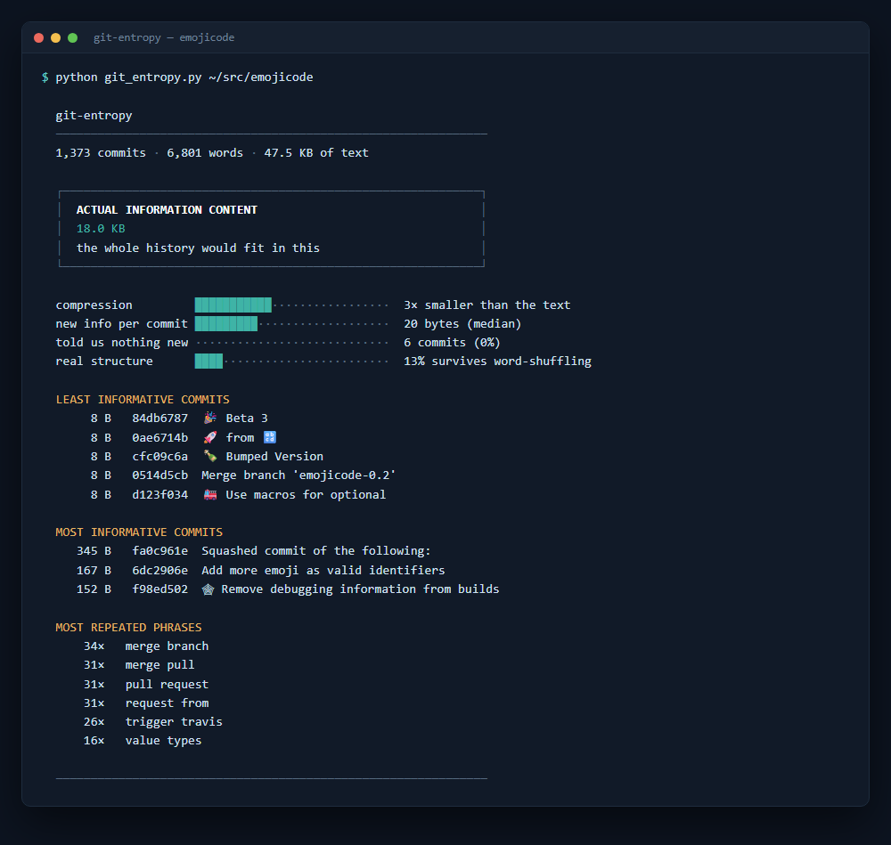

# git-entropy

How much information is actually in your commit history?

Not how many commits. Not how many words. How much **information** — the number of bytes you would
genuinely need to transmit your project's entire history to somebody else.

The answer is usually humbling.



That's [emojicode](https://github.com/emojicode/emojicode), a programming language written in emoji.
Six years of it. Every commit anyone ever wrote fits in **18 KB** — about the size of this README.

It also produces the only leaderboard of its kind, in which the least informative commit in the
project is `🎉 Beta 3` at 8 bytes, narrowly edged out for meaninglessness by `🚀 from 🔡`.

For a less whimsical control: Flask — fifteen years of work by hundreds of people, 5,539 commits —
comes to 120 KB.

## Run it

No install, no dependencies, works with the Python you already have:

```bash
curl -O https://raw.githubusercontent.com/FelixKramer/git-entropy/main/git_entropy.py
python git_entropy.py /path/to/repo
```

Or on the repo you're standing in:

```bash
python git_entropy.py
```

Options: `--limit N` for the last N commits, `--author NAME` to measure one person,
`--json` for machine-readable output, `--keep-trailers` to count `Co-authored-by:` and friends.

## What it measures

**Total information.** The compressed size of every commit message. Concrete and honest: this is what
it would cost to send someone your whole history.

**New information per commit.** The incremental cost of appending each message *given every message
before it*. A commit that repeats what the history already contains costs almost nothing to
transmit — which is precisely the sense in which it told you nothing. Computed in a single streaming
pass, so it's exact rather than sampled.

**Structure versus vocabulary.** This is the part people skip, and it's the only interesting bit.

## Why the obvious version is wrong

The naive approach is to compress the log and report the number. That measures your **vocabulary**,
not your information. If your team writes "fix" four hundred times, a compressor will happily tell
you the history is very compressible — but that's a fact about your word distribution, not about
what any commit communicated.

So `git-entropy` runs a control. It rebuilds the corpus with the **word frequencies preserved
exactly** and the arrangement destroyed, then compresses that too. Whatever survives the shuffle is
genuine structure: recurring phrases, templates, conventions. Whatever doesn't was only ever your
habitual word choice wearing a disguise.

That's the `real structure` line. For Flask it's 28%, and the giveaway is right there in the repeated
phrases — over a thousand commits beginning `Merge pull request from`. Real structure, generated by
a robot.

None of this is novel mathematics. Permutation nulls and compression-based information estimates are
old and well understood. What's uncommon is bothering to run the control at all, which is the whole
difference between measuring information and reading your own word-frequency table back to yourself.

## What it does *not* measure

Whether any of it was worth writing.

A 6-byte commit can be exactly the right commit. `typo` is a perfectly honest message for fixing a
typo, and a codebase where every commit scored highly would be a codebase in serious trouble. This
tool measures transmission cost, not virtue, and anyone using it to evaluate colleagues has
misunderstood it enthusiastically.

Trailers (`Co-authored-by:`, `Signed-off-by:`, `Closes:` …) are stripped by default. They're
machine-generated boilerplate attached to the message rather than anything a person wrote, and
leaving them in measures your tooling's signature instead of your team.

## Does this solve a problem?

No. It answers a question nobody asked, and I enjoyed answering it.

If it has any practical use, it's this: the same control that makes this tool honest — measure
against a null that preserves the boring properties of your data — is the control missing from an
enormous number of analyses that people do take seriously.

## Licence

MIT. Do whatever you like with it.

## Built by Dylan Wolpe
